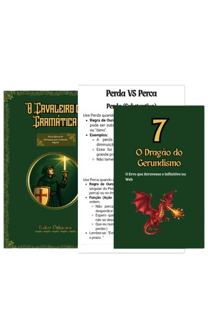

<h1>Projeto EBOOK com I.A </h1>

# 📘 O Cavaleiro da Gramática

---

📖 **Projeto desenvolvido para o curso _Fundamentos de IA Generativa_.**

Utilizei ferramentas como **Gemini**, **ChatGPT**, **Photopea** e **Canva**, aplicando as técnicas ensinadas pelo instrutor.  
O resultado foi este eBook que une **literatura, RPG e tecnologia**.

---

### 🔗 Leia o eBook

👉 [**Clique aqui para abrir o PDF**](Book/O-cavaleiro-da-gramática.pdf)

---

Feito com 💡 criatividade, ☕ café e 🤖 IA.

